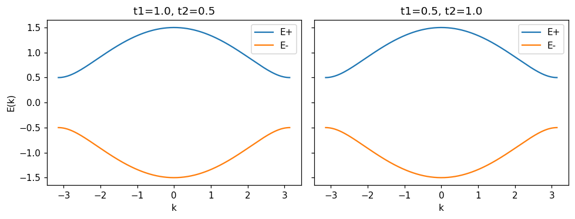
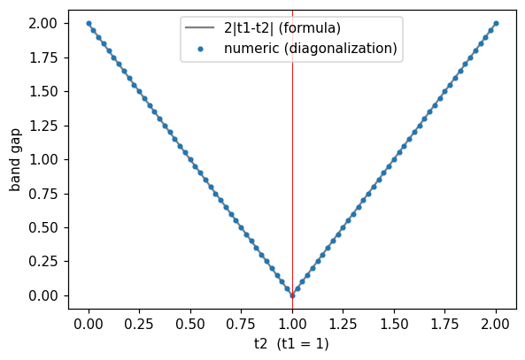
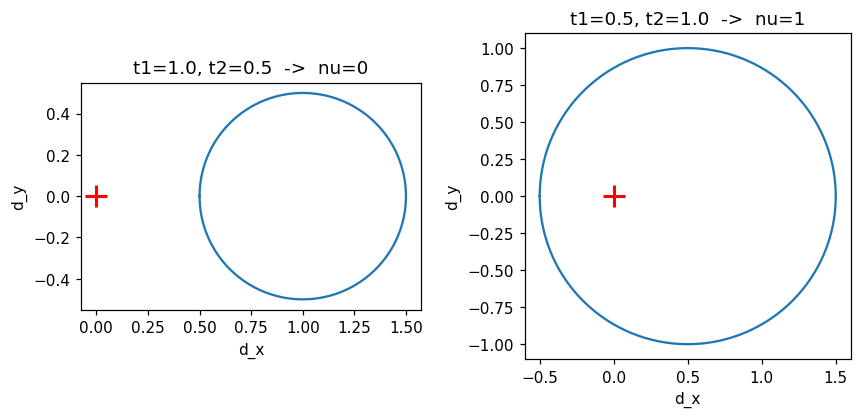
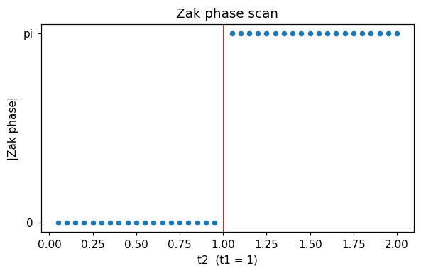

# 중간고사 프로젝트 — SSH 모델 기반 1차원 토폴로지 절연체

Tight-binding 모델(SSH, Su–Schrieffer–Heeger)의 밴드구조와 Zak phase(위상 불변량)를 수치적으로 계산하고,
bulk–boundary correspondence(edge state 존재)를 검증하는 프로젝트입니다.

## 한 줄 요약

갭 크기와 밴드 모양이 **같은** 두 사슬 $(t_1,t_2)=(1,0.5)$와 $(0.5,1)$이 위상수(= Zak phase$/\pi$)로 구별되고,
위상수가 1인 사슬만 끝에 $E\approx0$ edge state 2개를 갖는다는 것을 수치로 확인했습니다.

## 확인한 내용과 결과

| 확인 항목 | 방법 | 결과 |
|---|---|---|
| 단원자 사슬 해석식 $E(k)=\epsilon_0-2t\cos ka$ | 원자 20개 고리(주기경계)의 $20\times20$ 행렬 대각화 vs 해석식 | 최대 차이 $1.1\times10^{-15}$ |
| 유한 크기 효과 | 원자 수 20 / 21 / 200 / 201 에서 밴드 꼭대기 | 2.0000 / 1.9777 / 2.0000 / 1.9998 (짝수면 $k=\pi/a$를 정확히 지남) |
| SSH 밴드 $E_\pm=\pm\|t_1+t_2e^{ika}\|$ | $2\times2$ Bloch 행렬 대각화 vs 해석식 (`assert`) | 일치. $t_1\leftrightarrow t_2$ 를 바꿔도 밴드 모양이 같음 |
| 밴드갭 $2\|t_1-t_2\|$ | $t_1=1$, $t_2\in[0,2]$ 에서 각각 대각화 | 최대 차이 $2.4\times10^{-16}$, $t_2=t_1$ 에서 0 |
| $t_1=t_2$ 이면 균일한 사슬 | SSH 고리와 단원자 고리의 스펙트럼 비교 | 차이 0 |
| 위상수 (회전수) | $\mathbf d(k)$ 곡선이 원점을 감는 횟수 | $(1,0.5)\to0$, $(0.5,1)\to1$, $(2,1)\to0$, $(1,3)\to1$ |
| Zak phase | 이웃 고유벡터 겹침의 곱으로 계산, $t_2$ 스캔 | $t_2<t_1$ 에서 0, $t_2>t_1$ 에서 $\pi$ (벗어남 $<10^{-15}$) |
| edge state | 셀 20개(원자 40개) 유한 사슬 대각화, $\|E\|<0.1$ | 위상수 1: 2개 / 위상수 0: 0개 (가장 가까운 에너지 $\pm0.51$) |
| edge state 진폭 | 손으로 푼 $\psi_{A,n}\propto(-t_1/t_2)^{n-1}$ 과 비교 | 이웃 셀 진폭비 수치 0.5 = 이론 $t_1/t_2$ = 0.5 |

## 환경

- 필요 패키지: `numpy`, `matplotlib` (그 외 없음)
- 노트북은 Python 3.12.3 에서 처음부터 끝까지 에러 없이 실행됨을 확인했습니다.
- 실행 환경: VS Code + Jupyter 확장 또는 JupyterLab

## 실행 방법

1. `tight_binding.ipynb` 를 VS Code 또는 Jupyter 에서 엽니다.
2. Restart → Run All 로 처음부터 순서대로 실행합니다 (몇 초 걸립니다).
3. 결과(그래프와 출력)는 노트북에 이미 저장되어 있어서 실행하지 않아도 볼 수 있습니다.

## 노트북 구성

각 절은 **예측 → 실행 → 확인 → 질문** 순서입니다.

0. 설정
1. 1D 단원자 사슬 (베이스라인) + 행렬 대각화로 해석식 검증
2. SSH Bloch 해밀토니안과 밴드 (두 사슬의 밴드가 같음을 확인)
3. 밴드갭 (공식 vs 수치, $t_2$ 스캔, $t_1=t_2$ 극한)
4. 위상수(winding number) + Zak phase 와 $t_2$ 스캔
5. 유한 사슬과 edge state (진폭 감쇠를 이론과 비교)
6. 정리

## 한계와 주의

- 유한 사슬은 **A 사이트로 시작하고 셀 안 결합을 $t_1$ 로 둔다**는 규약입니다. 이 규약을 바꾸면 자명/비자명이 뒤바뀝니다.
- Zak phase 의 **부호는 규약(위상 방향, 단위셀 원점)에 따라 달라지므로** 크기만 비교했습니다.
- edge state 의 에너지가 $E=0$ 에 고정되는 것은 카이랄 대칭 덕분입니다 (온사이트 퍼텐셜을 넣으면 깨짐). 이 부분은 이론으로만 다뤘고 노트북에서 계산하지 않았습니다.
- 그래핀(2D 확장)은 이 노트북에 포함하지 않았습니다.

## 파일 구조

```
midterm-tight-binding/
├── README.md
├── tight_binding.ipynb
└── figs/        # 노트북이 만든 그림 (README 와 발표자료용)
```

## 그림

| 두 사슬의 밴드 (동일) | 밴드갭 vs $t_2$ |
|---|---|
|  |  |

| $\mathbf d(k)$ 곡선 (원점을 감는가) | Zak phase 스캔 |
|---|---|
|  |  |


## 참고 문헌 (이론 배경)

- W. P. Su, J. R. Schrieffer, A. J. Heeger, *Phys. Rev. Lett.* **42**, 1698 (1979)
- J. Zak, *Phys. Rev. Lett.* **62**, 2747 (1989)
- J. K. Asbóth, L. Oroszlány, A. Pályi, *A Short Course on Topological Insulators*, Springer (2016), arXiv:1509.02295
