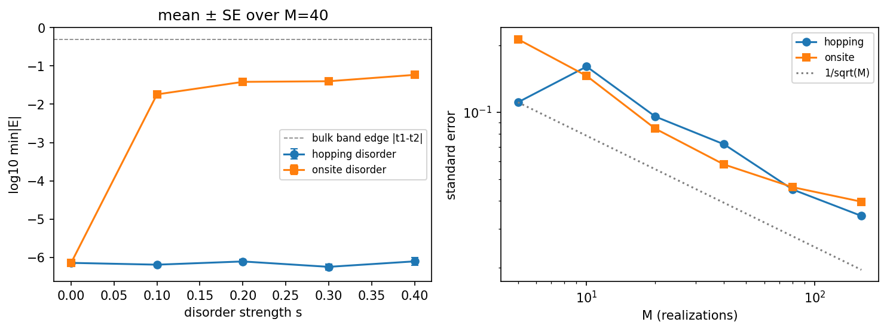
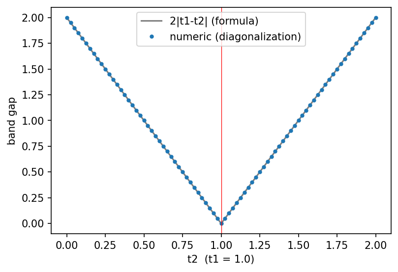
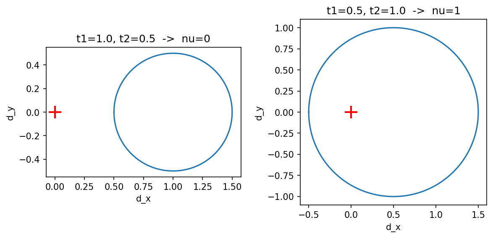
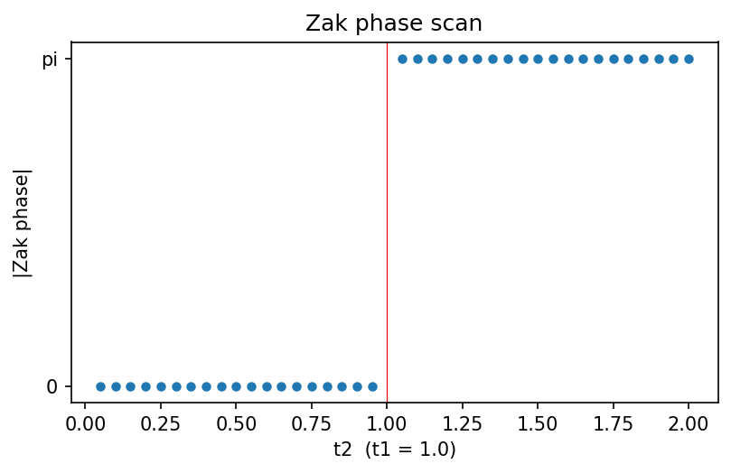
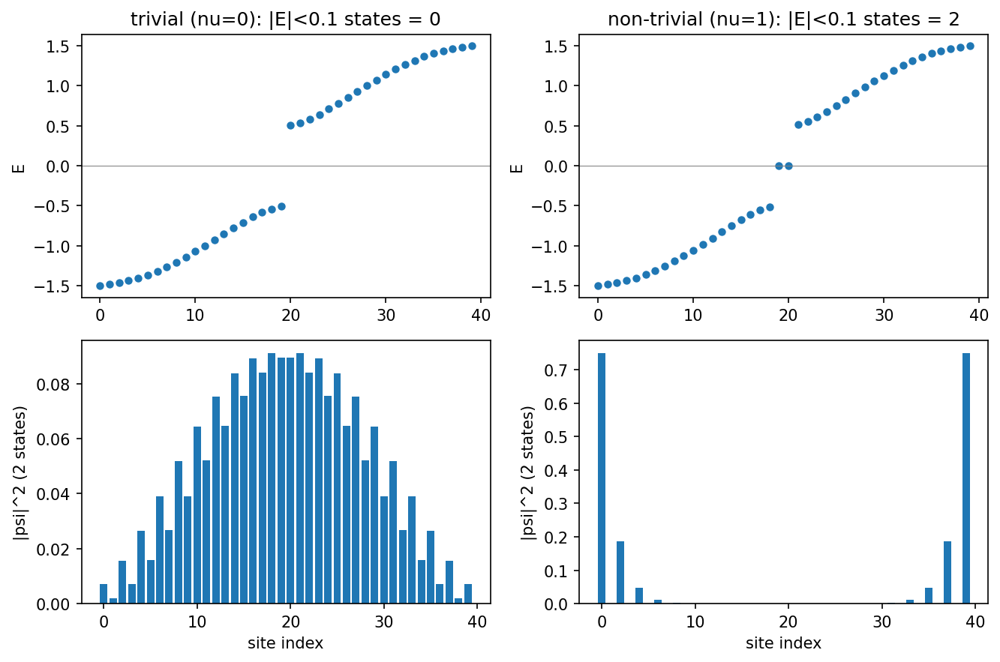

# 중간고사 프로젝트 — SSH 모델의 밴드구조와 위상 (Tight-Binding)

## 물리 질문

> 밴드 모양과 갭 크기가 **같은** 두 SSH 사슬은 무엇으로 구별되고, 그 차이는 어떤 관측 가능한 결과로 나타나는가?

계산한 양: 밴드 $E_\pm(k)$, 갭, 위상수 $\nu$(= Zak phase$/\pi$), 유한 사슬의 $E\approx0$ 상태.

**결론 (수치로 확인)**: $(t_1,t_2)=(1,0.5)$와 $(0.5,1)$은 밴드와 갭이 똑같지만 위상수가 0과 1로 다르고,
위상수가 1인 사슬만 열린 경계에서 $E\approx0$ 에지 상태 2개를 갖는다.

## 모델, 가정, 경계조건

| 항목 | 내용 |
|---|---|
| 모델 | SSH 사슬: 단위셀에 A, B 두 원자, 셀 안 hopping $t_1$, 셀 사이 hopping $t_2$ |
| 가정 | 최근접 hopping만, 오비탈은 직교, 온사이트 에너지 없음(카이랄 대칭), $a=1$, $\hbar=1$ |
| 경계조건 | 주기: 밴드, Bloch 해밀토니안, 원자 고리 / 열린: 유한 사슬(에지 상태) |
| 규약 | 유한 사슬은 A 사이트로 시작하고 첫 결합이 $t_1$ (바꾸면 자명/비자명이 뒤바뀜) |

## 수치 방법과 선택 이유

| 방법 | 이유 |
|---|---|
| 행렬 대각화 (`numpy.linalg.eigh`) | 행렬이 작아서(2×2, 40×40) 정확하고, 시간 간격 같은 수렴 변수가 없음 |
| 이웃 고유벡터 겹침의 곱으로 Zak phase | 고유벡터의 임의 위상에 영향받지 않는 게이지 불변 형태 |
| 각도 증분의 합으로 회전수(winding) | 닫힌 곡선이 원점을 감는 횟수를 정수로 직접 계산 |

## 폴더 구성

```
midterm-tight-binding/
├── README.md
├── tight_binding.ipynb      # 코드 (실행 결과 포함)
├── input/
│   └── params.json          # 입력: 계산 조건 (t1, t2 쌍, 격자 점 수, 사슬 길이, 무질서 설정, 난수 시드)
└── output/
    ├── summary.json         # 핵심 수치 모음
    ├── *.csv                # 계산 결과 (밴드, 갭, Zak 스캔, 에지 상태, 해상도, 무질서)
    └── figs/*.png           # 그림 (fig1 ~ fig9, fig_zak_scan)
```

## 환경과 실행 방법

- Python 3.12.3, `numpy` 2.4.4, `matplotlib` 3.10.8 (그 외 패키지 없음)
- 실행: `tight_binding.ipynb`를 VS Code 또는 Jupyter에서 열고 **Restart → Run All** (약 10초)
- 계산 조건을 바꾸려면 `input/params.json`을 수정하고 다시 실행한다. 이 파일이 없으면 노트북이 기본값으로 만든다.
- 난수는 `params.json`의 `disorder.seed`로 고정되어 있어서 같은 결과가 재현된다.
- 실행하면 `output/` 아래의 csv, json, 그림이 새로 쓰인다.

## 결과와 검증

### 1. 기준과의 비교 (정확한 결과, 극한 경우)

| 비교 | 결과 |
|---|---|
| 원자 20개 고리 $20\times20$ 대각화 vs 해석식 $\epsilon_0-2t\cos ka$ | 최대 차이 $1.1\times10^{-15}$ |
| SSH $2\times2$ 대각화 vs $\pm\lvert t_1+t_2e^{ika}\rvert$ | 최대 차이 $2.2\times10^{-16}$ |
| 수치 갭 vs $2\lvert t_1-t_2\rvert$ ($t_2\in[0,2]$) | 최대 차이 $2.4\times10^{-16}$, $t_2=t_1$에서 0 |
| 극한 $t_1=t_2$: SSH 고리 vs 같은 원자 수의 단원자 고리 | 스펙트럼 차이 0 |
| 극한 $t_1\to0$: 끝 원자가 완전히 분리 | 영모드 정확히 2개, 끝 사이트 확률 1.000 / 1.000 |
| 극한 $t_2\to0$: 이합체만 남음 | 모든 $\lvert E\rvert=t_1$, 영모드 없음 |
| 에지 상태 진폭비 vs $t_1/t_2$ | 수치 0.5000, 이론 0.5 |

### 2. 수치 해상도

| 바꾼 것 | 보는 양 | 결과 |
|---|---|---|
| $k$ 격자 점 수 $N_k$ | 갭, 위상수, Zak phase | 짝수 $N_k$는 $k=\pi$를 지나 갭 오차 0, $N_k\ge4$에서 위상수가 맞음. 홀수 $N_k$는 갭을 과대평가하고, 갭이 작으면 위상수가 틀림. 홀수 격자가 맞는 최소 $N_k$: 갭 1.0 → 5, 0.4 → 7, 0.2 → 9, 0.1 → 11, 0.04 → 17 |
| 고리 원자 수 $N$ | 밴드 꼭대기와 $2t$의 차이 | 짝수 $N$은 $\sim10^{-16}$, 홀수 $N$은 $2t(1-\cos(\pi/N))$과 일치 ($N=11$: 0.081, $N=101$: $9.7\times10^{-4}$) |
| 유한 사슬의 셀 수 $N_c$ | 영모드 분리 $\min\lvert E\rvert$ | 지수적으로 감소. 기울기 $-0.693$ (이론 $\ln(t_1/t_2)=-0.693$), $t_1/t_2=0.8$에서 $-0.224$ (이론 $-0.223$) |

### 3. 샘플링 (무질서 계산)

비자명 사슬($t_1=0.5$, $t_2=1$, 셀 20개)에 같은 세기 $s$의 무작위 섭동을 준다. 실현 수 $M=40$, 보는 양 $x=\log_{10}\min\lvert E\rvert$, 평균 ± 표준오차.

| $s$ | hopping 무질서 (카이랄 대칭 유지) | 온사이트 무질서 (카이랄 대칭 깨짐) |
|---|---|---|
| 0.1 | $-6.19\pm0.02$ | $-1.74\pm0.06$ |
| 0.2 | $-6.11\pm0.05$ | $-1.42\pm0.07$ |
| 0.3 | $-6.25\pm0.08$ | $-1.40\pm0.08$ |
| 0.4 | $-6.11\pm0.10$ | $-1.23\pm0.09$ |

표준오차는 실현 수 $M$이 커지면 대략 $1/\sqrt M$로 줄어든다 ($M=5\to160$: 0.11 → 0.034 / 0.21 → 0.040).



### 4. 해석

- 밴드가 같아도($\mathbf d(k)$ 곡선이 원점을 감느냐가 다르다) 위상수가 0과 1로 구별되고, $\nu=1$일 때만 끝에 $E\approx0$ 상태 2개가 있다.
- hopping 무질서에서는 영모드가 $E=0$에 그대로 있고($\sim10^{-6}$), 온사이트 무질서에서는 $E=0$에서 떨어진다($0.02\sim0.06$, 갭 안에는 남음). 에지 상태가 $E=0$에 고정되는 것은 카이랄 대칭 덕분이라는 이론적 설명과 맞는다.

| 두 사슬의 밴드 (동일) | 밴드갭 vs $t_2$ |
|---|---|
|  |  |

| $\mathbf d(k)$ 곡선 (원점을 감는가) | Zak phase 스캔 |
|---|---|
|  |  |



## 한계와 확인하지 않은 것

| 확인하지 않은 것 | 어떻게 확인할 것인가 |
|---|---|
| 큰 무질서($s>0.4$)에서 벌크 갭이 닫힐 때 | $s$를 키우며 벌크 갭과 $\min\lvert E\rvert$를 함께 추적 |
| 실제 물질(폴리아세틸렌 등)의 $t_1, t_2$ | 문헌의 hopping 값으로 같은 계산을 반복하고 측정된 갭과 비교 |
| 2차원(그래핀), 스핀–궤도 결합 | 이웃 3개의 벌집격자 해밀토니안으로 확장하고 Kane–Mele 항 추가 |
| 전자–전자 상호작용 | 이 모델의 범위 밖 (평균장 이상의 방법 필요) |

- 유한 사슬은 A 사이트로 시작하고 셀 안 결합이 $t_1$이라는 규약이다. $t_1\leftrightarrow t_2$를 바꾸면 자명/비자명이 뒤바뀐다. Zak phase의 부호도 규약에 의존해서 크기만 비교했다.
- 무질서 계산은 $s\le0.4$, 셀 20개, 균등분포만 확인했다.

## 참고 문헌 (이론 배경)

- W. P. Su, J. R. Schrieffer, A. J. Heeger, *Phys. Rev. Lett.* **42**, 1698 (1979)
- J. Zak, *Phys. Rev. Lett.* **62**, 2747 (1989)
- J. K. Asbóth, L. Oroszlány, A. Pályi, *A Short Course on Topological Insulators*, Springer (2016), arXiv:1509.02295
